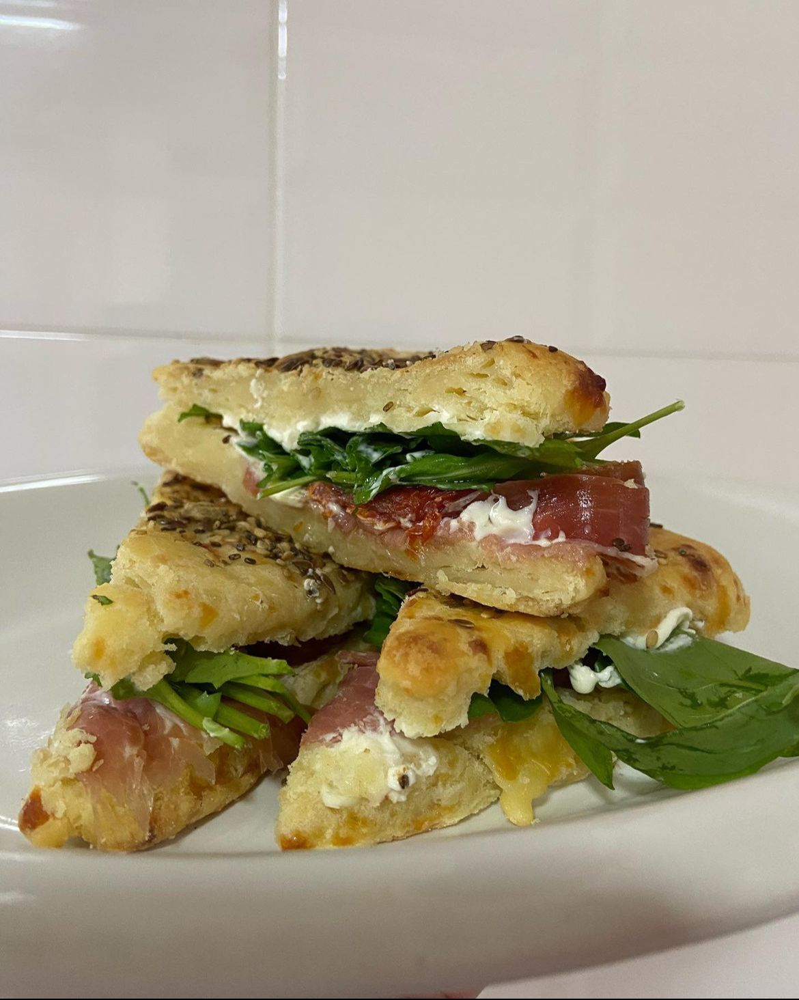
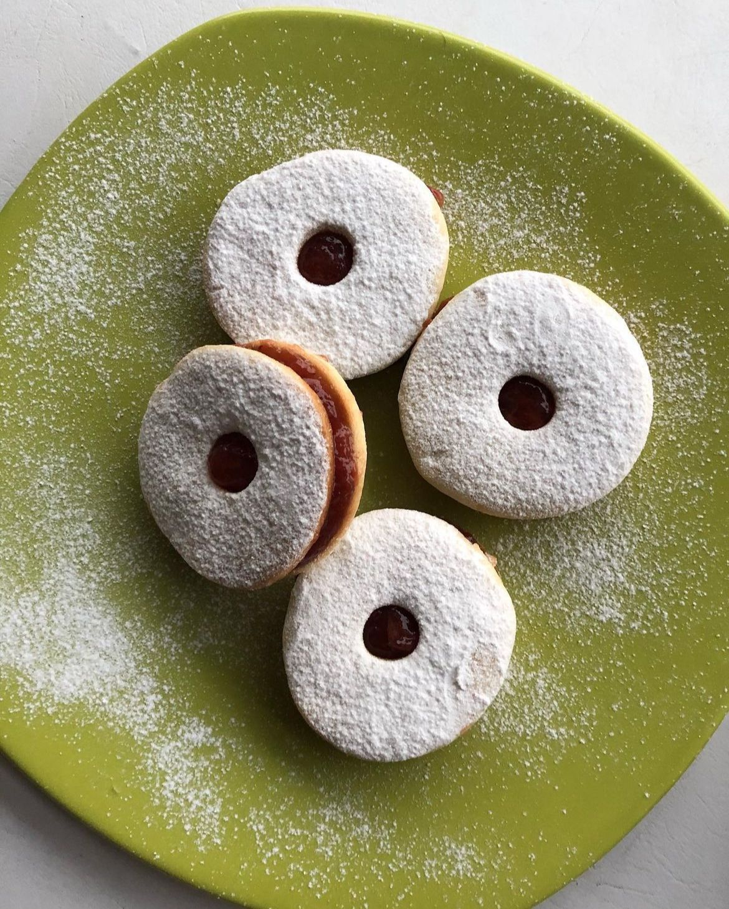
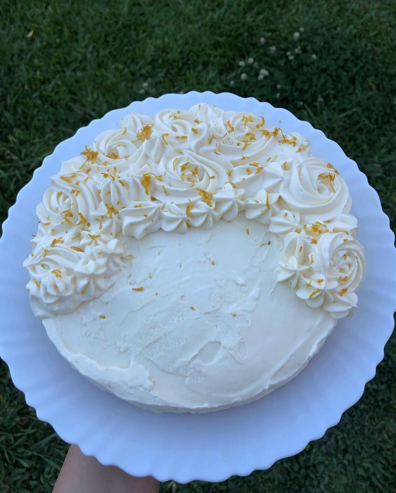
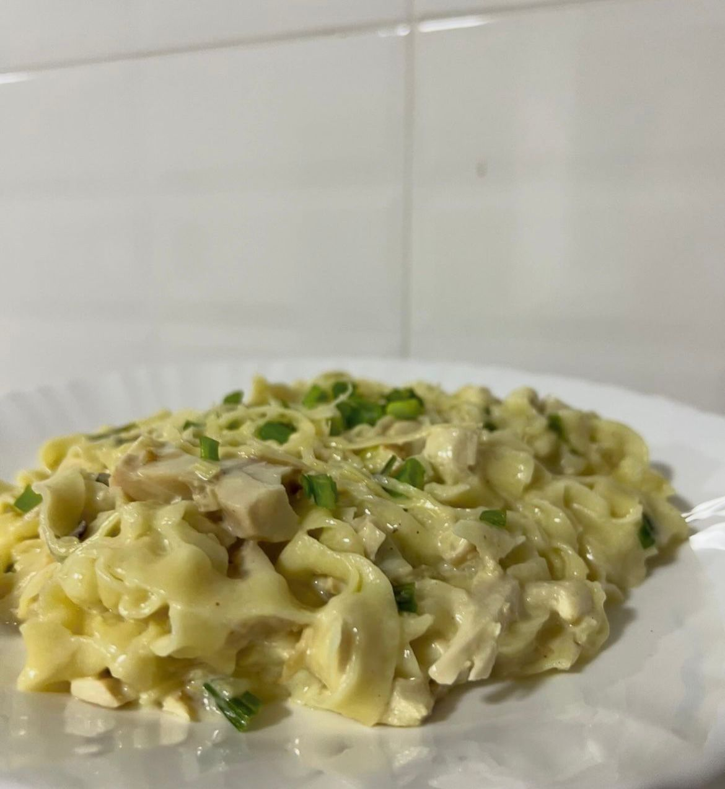
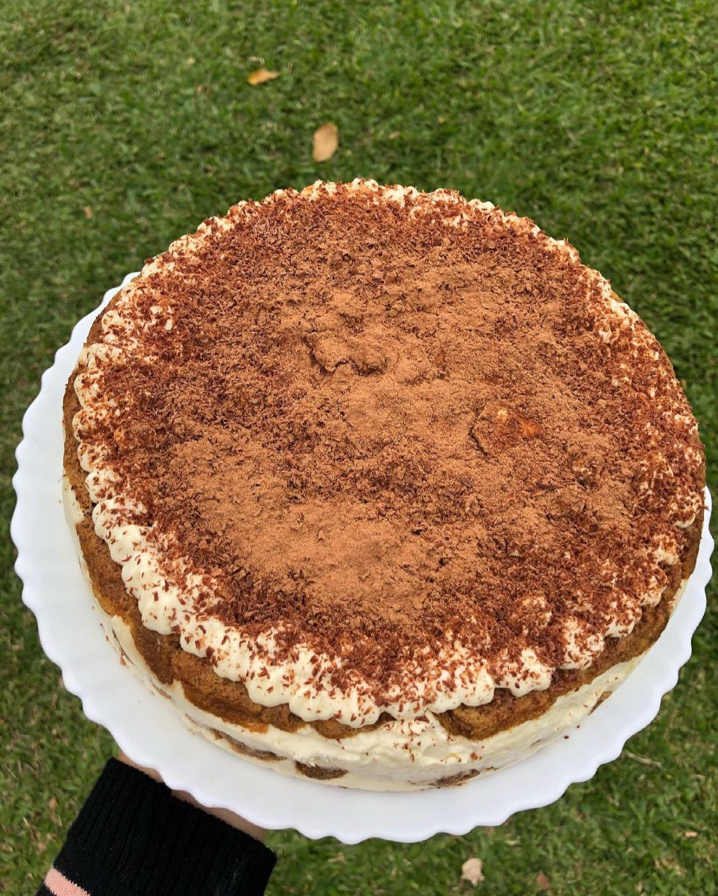
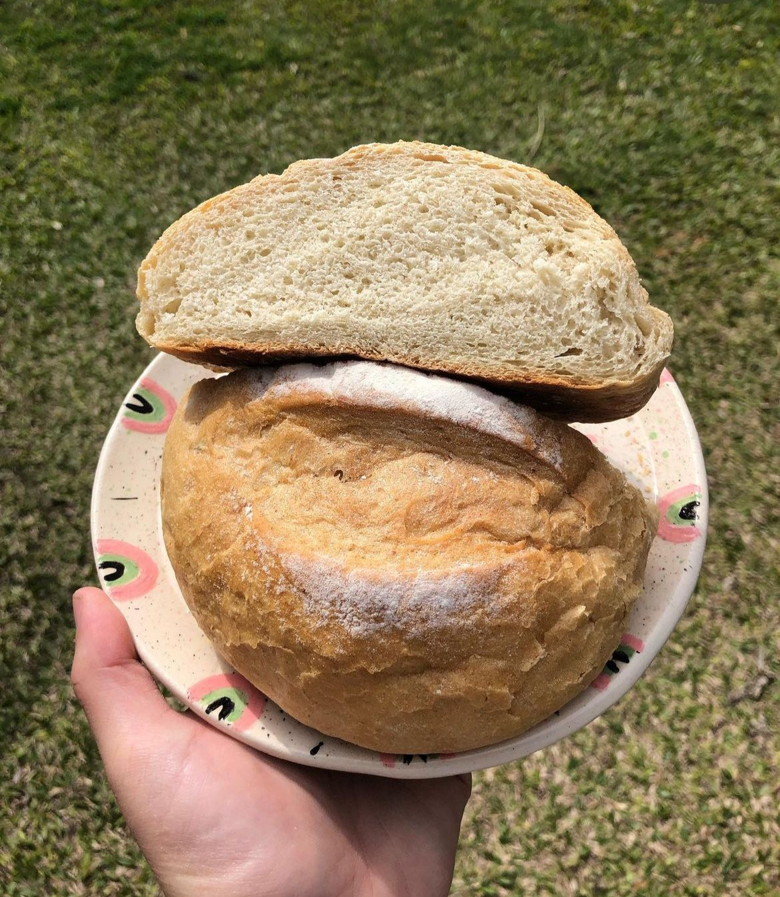
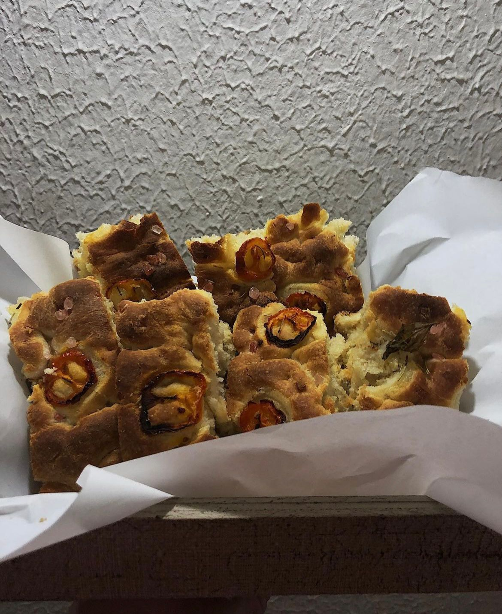

# web-integrador

## Agos Cocina - Proyecto

### - Objetivo principal y público objetivo
 La página va a estar enfocada en una presentación de lo que es el proyecto de una profesional gastronómica "Agos Cocina", en donde se podrán encontrar tanto recetarios, como productos e información útil sobre cómo reemplazar alimentos por otros más saludables. Estará dirigido a un público culinario y cocineros sin experiencia que quieran aprender.

### - Ideas del cliente y contenido 
 1 Primera página --> Inicio: página principal que contenga el eslogan del proyecto, 4 marcos con fotos de algunas recetas y una breve descripción sobre qué se va a encontrar en la web y hacia qué va enfocado.

 2 Segunda página --> Recetas: página secundaria en donde se presenten algunas recetas principales (3 o 4) y datos para su preparación, ingredientes, tips, etc.

### - Presentación de las ideas

 1 Inicio: Logo junto al nombre.
Sección "Inicio" (en tamaño más grande y negrita) junto a sección "Recetas"
Bajo el texto de presentación/descripción un botón que lleve a la segunda página
Página secundaria: Logo junto al nombre.
Sección "Inicio" junto a sección "Recetas"(en tamaño más grande y negrita)
Imagen receta 1 --> Nombre de la receta y breve descripción, debajo un resumen rápido de la preparación. Junto un botón que amplíe los detalles de la receta
Imagen receta 2 --> Nombre de la receta y breve descripción, debajo un resumen rápido de la preparación. Junto un botón que amplíe los detalles de la receta

### - Wireframe
 Página principal: 
 Página secundaria:

## - Diseño UI

### 1 | Fonts

Font: https://fonts.google.com/share?selection.family=Montserrat:ital,wght@0,100..900;1,100..90

### 2 | Colores

#86654B
#D1C8C1
#F6F4F3
#E0E0E0

### 3 | Imágenes    

